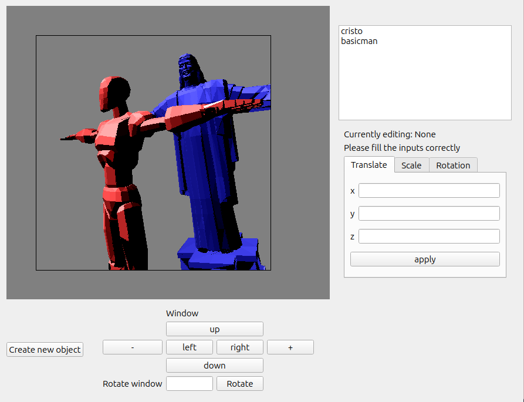

# PyGL
Final project of INE5420 - Computer Graphics

## Dependencies
```shell
pip install pyqt5 numpy
```
## Execution
On the directory containing "execute.py" run
```shell
python3 execute.py
```




